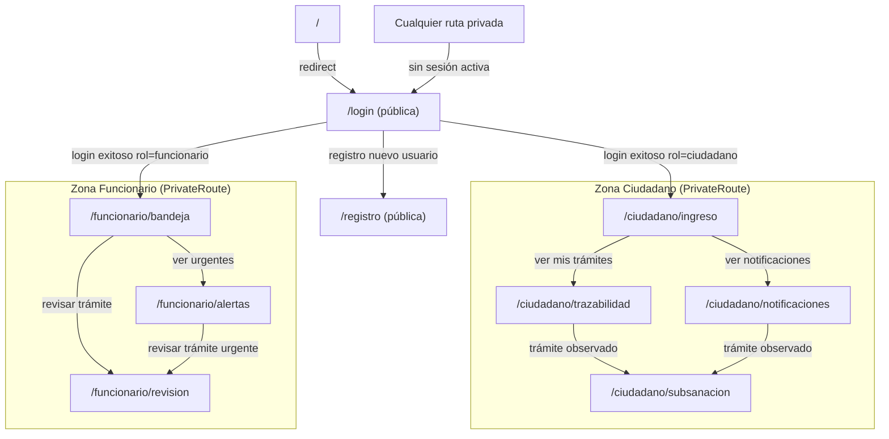

# Diagrama de Arquitectura de Navegación

## Estructura de rutas y jerarquía de vistas

## Diferenciación de acceso por rol

| Evento                    | Ciudadano                    | Funcionario                  |
| ------------------------- | ---------------------------- | ---------------------------- |
| Login exitoso             | `/ciudadano/ingreso`         | `/funcionario/bandeja`       |
| Sin sesión activa         | Redirige a `/login`          | Redirige a `/login`          |
| Intento de ruta ajena     | Bloqueado por `PrivateRoute` | Bloqueado por `PrivateRoute` |
