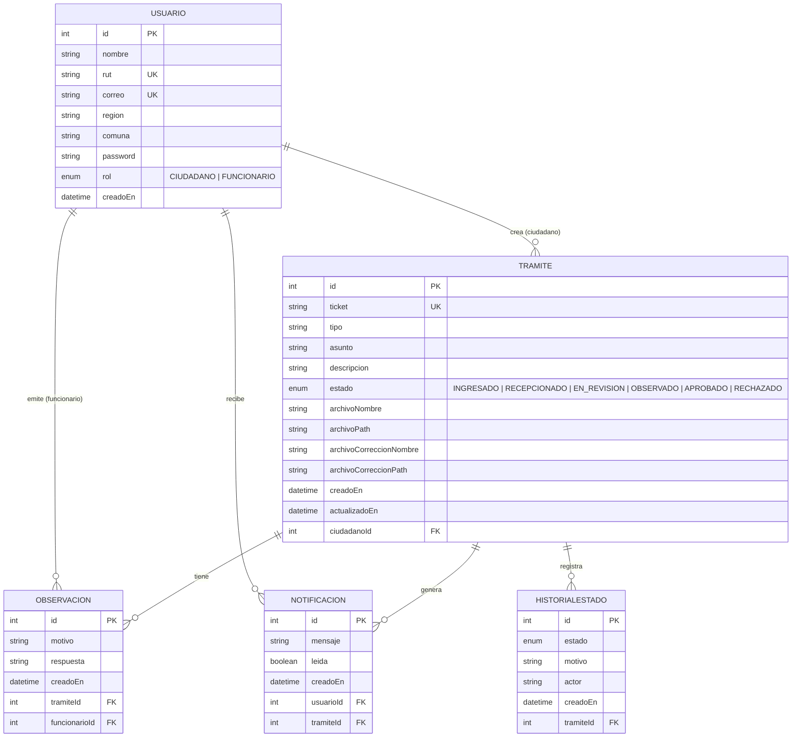

# Diagrama Entidad-Relación — Portal de Trámites Municipales

## Modelo relacional

## Relaciones y restricciones

| Tabla origen | FK | Tabla destino | Constraint |
|---|---|---|---|
| Tramite | ciudadanoId | Usuario | RESTRICT — no se puede borrar usuario con trámites |
| Observacion | tramiteId | Tramite | RESTRICT — no se puede borrar trámite con observaciones |
| Observacion | funcionarioId | Usuario | RESTRICT — no se puede borrar funcionario con observaciones |
| Notificacion | usuarioId | Usuario | RESTRICT |
| Notificacion | tramiteId | Tramite | DELETE manual — las notificaciones se eliminan explícitamente antes de borrar el trámite |
| HistorialEstado | tramiteId | Tramite | CASCADE — el historial se elimina junto con el trámite |

## Restricciones de unicidad

| Tabla | Campo | Descripción |
|---|---|---|
| Usuario | rut | Un RUT solo puede registrarse una vez |
| Usuario | correo | Un correo solo puede registrarse una vez |
| Tramite | ticket | El número de ticket es único (TRK-XXXX) |
