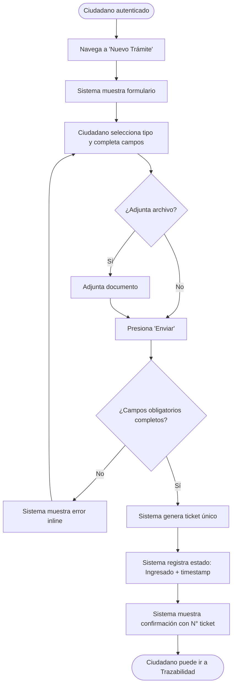
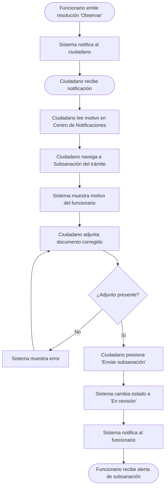
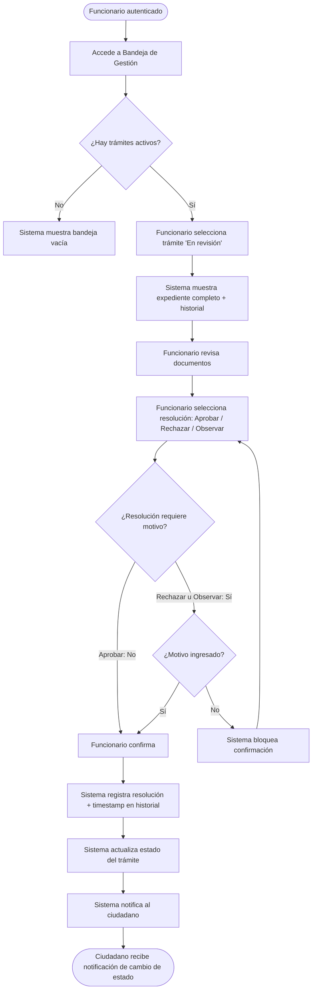

# Task Flows — Portal de Trámites Municipales

## TF-01: Ciudadano ingresa un trámite

```mermaid
flowchart TD
    A([Ciudadano autenticado]) --> B[Navega a 'Nuevo Trámite']
    B --> C[Sistema muestra formulario]
    C --> D[Ciudadano selecciona tipo y completa campos]
    D --> E{¿Adjunta archivo?}
    E -->|Sí| F[Adjunta documento]
    E -->|No| G[Presiona 'Enviar']
    F --> G
    G --> H{¿Campos obligatorios completos?}
    H -->|No| I[Sistema muestra error inline]
    I --> D
    H -->|Sí| J[Sistema genera ticket único]
    J --> K[Sistema registra estado: Ingresado + timestamp]
    K --> L[Sistema muestra confirmación con N° ticket]
    L --> M([Ciudadano puede ir a Trazabilidad])
```

## TF-02: Ciudadano subsana observación

```mermaid
flowchart TD
    A([Funcionario emite resolución 'Observar']) --> B[Sistema notifica al ciudadano]
    B --> C([Ciudadano recibe notificación])
    C --> D[Ciudadano lee motivo en Centro de Notificaciones]
    D --> E[Ciudadano navega a Subsanación del trámite]
    E --> F[Sistema muestra motivo del funcionario]
    F --> G[Ciudadano adjunta documento corregido]
    G --> H{¿Adjunto presente?}
    H -->|No| I[Sistema muestra error]
    I --> G
    H -->|Sí| J[Ciudadano presiona 'Enviar subsanación']
    J --> K[Sistema cambia estado a 'En revisión']
    K --> L[Sistema notifica al funcionario]
    L --> M([Funcionario recibe alerta de subsanación])
```

## TF-03: Funcionario revisa y resuelve un trámite

```mermaid
flowchart TD
    A([Funcionario autenticado]) --> B[Accede a Bandeja de Gestión]
    B --> C{¿Hay trámites activos?}
    C -->|No| D[Sistema muestra bandeja vacía]
    C -->|Sí| E[Funcionario selecciona trámite 'En revisión']
    E --> F[Sistema muestra expediente completo + historial]
    F --> G[Funcionario revisa documentos]
    G --> H[Funcionario selecciona resolución: Aprobar / Rechazar / Observar]
    H --> I{¿Resolución requiere motivo?}
    I -->|Aprobar: No| J[Funcionario confirma]
    I -->|Rechazar u Observar: Sí| K{¿Motivo ingresado?}
    K -->|No| L[Sistema bloquea confirmación]
    L --> H
    K -->|Sí| J
    J --> M[Sistema registra resolución + timestamp en historial]
    M --> N[Sistema actualiza estado del trámite]
    N --> O[Sistema notifica al ciudadano]
    O --> P([Ciudadano recibe notificación de cambio de estado])
```
